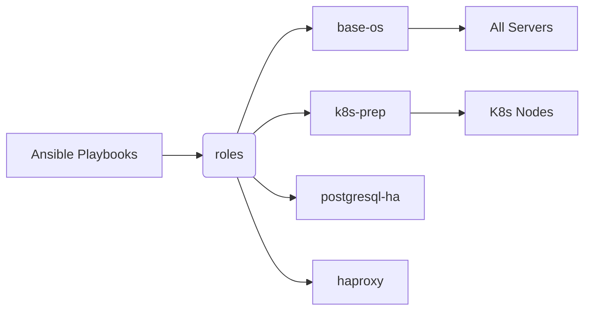

# Infrastructure Ansible

This repository contains the Ansible playbooks and roles responsible for the fine-grained configuration (OS hardening, Kubernetes preparation, HA databases, load balancers, etc.) of servers provisioned by Terraform.

## Role Architecture

## State Management (Inventory)

The files under `environments/example/` demonstrate a clean, modular structure containing dummy IP addresses for Load Balancers, Kubernetes Masters, Workers, DBs, and Bastion servers. Sensitive variables and hashes are intended to be encrypted using Ansible Vault (represented as `{{ vault_password }}` in the examples).

## Best Practices
Fail-safe operations, such as enforcing `set -euo pipefail` and `trap` in bash scripts, are considered defaults. The ultimate goal is to enable a Developer Self-Service model where infrastructure configuration can be orchestrated without manual ticket creation.
