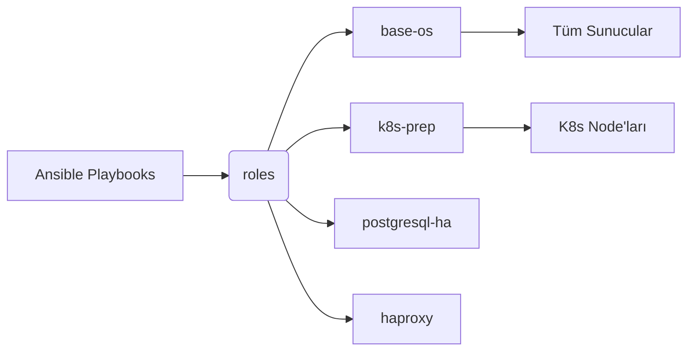

# Altyapı Ansible

Bu dizin, Terraform tarafından hazırlanan sunucuların ince ayar konfigürasyonundan (OS sıkılaştırma, Kubernetes hazırlık, HA veritabanları, yük dengeleyiciler vb.) sorumlu Ansible playbook ve rollerini içerir.

## Rol Mimarisi

## Durum Yönetimi (Envanter)

`environments/example/` altındaki dosyalar; Load Balancer'lar, Kubernetes Master'lar, Worker'lar, Veritabanları ve Bastion sunucuları için örnek IP adresleri içeren temiz, modüler bir yapı gösterir. Hassas değişkenler ve hash'ler Ansible Vault ile şifrelenmelidir (örneklerde `{{ vault_password }}` olarak temsil edilir).

## En İyi Pratikler

Bash scriptlerinde `set -euo pipefail` ve `trap` kullanımı gibi hata güvenli operasyonlar varsayılan olarak uygulanır. Nihai hedef, altyapı konfigürasyonunun manuel ticket oluşturmadan orkestre edilebildiği bir Geliştirici Self-Service modeli sunmaktır.
