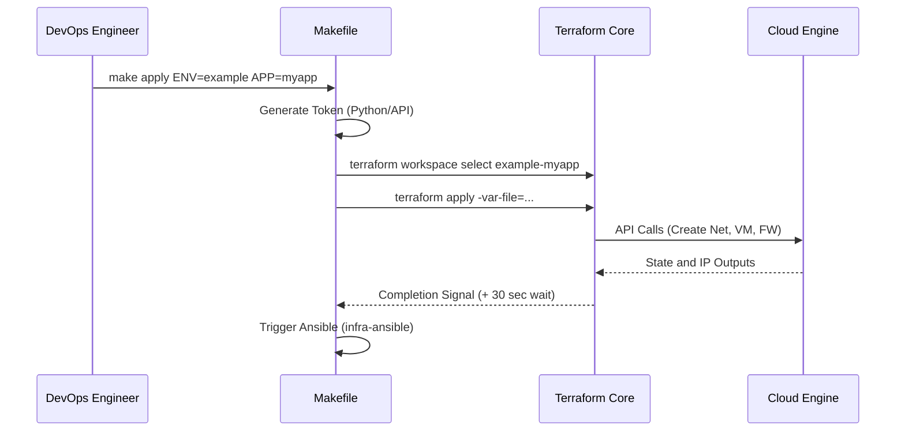

# Infrastructure Terraform Core

This repository acts as the central backbone that consumes modules from `terraform/modules` to provision entire real-world environment architectures (such as UAT, Prod, Example, etc.).

## Orchestration Flow



## Usage

This directory contains the root infrastructure configuration. Variables are injected dynamically by the root `Makefile` from the central `environments/` directory.

You do not need to run `terraform apply` manually. Navigate to the monorepo root and execute:

```bash
make apply ENV=example APP=myapp
```
