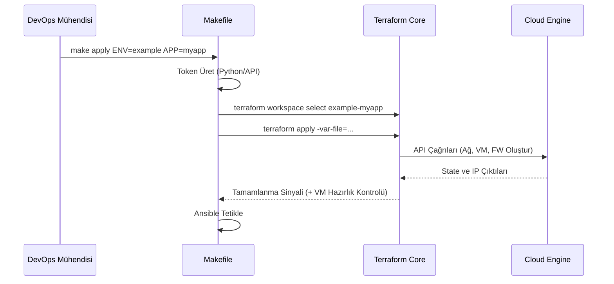

# Altyapı Terraform Çekirdeği

Bu dizin, `terraform/modules` altındaki modülleri kullanarak gerçek ortam mimarilerini (UAT, Prod, Example vb.) hazırlayan merkezi omurgadır.

## Orkestrasyon Akışı



## Kullanım

Bu dizin kök altyapı konfigürasyonunu içerir. Değişkenler, merkezi `environments/` dizininden kök `Makefile` tarafından dinamik olarak enjekte edilir.

`terraform apply` komutunu elle çalıştırmanıza gerek yoktur. Monorepo kök dizinine gidin ve çalıştırın:

```bash
make apply ENV=example APP=myapp
```
