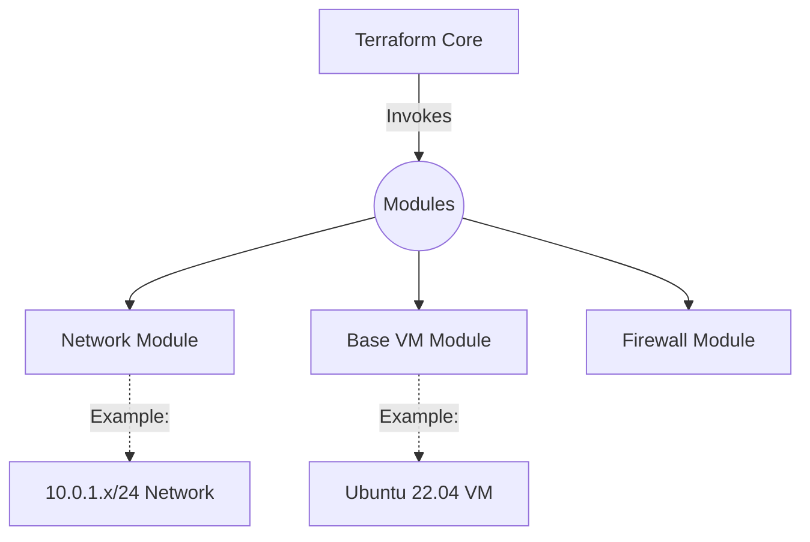

# Infrastructure Terraform Modules

This repository contains 100% modular, highly reusable, and production-ready infrastructure-as-code (IaC) modules meant for deploying standardized resources.

## Architecture

## Core Principles

1. **Immutable Infrastructure:** Servers are treated as "cattle", not "pets".
2. **Generic Design:** Zero hardcoded company-specific IPs, private keys, or proprietary naming conventions.

## Usage
Refer to the `README.md` file within each specific module's directory for detailed usage instructions and input variables.